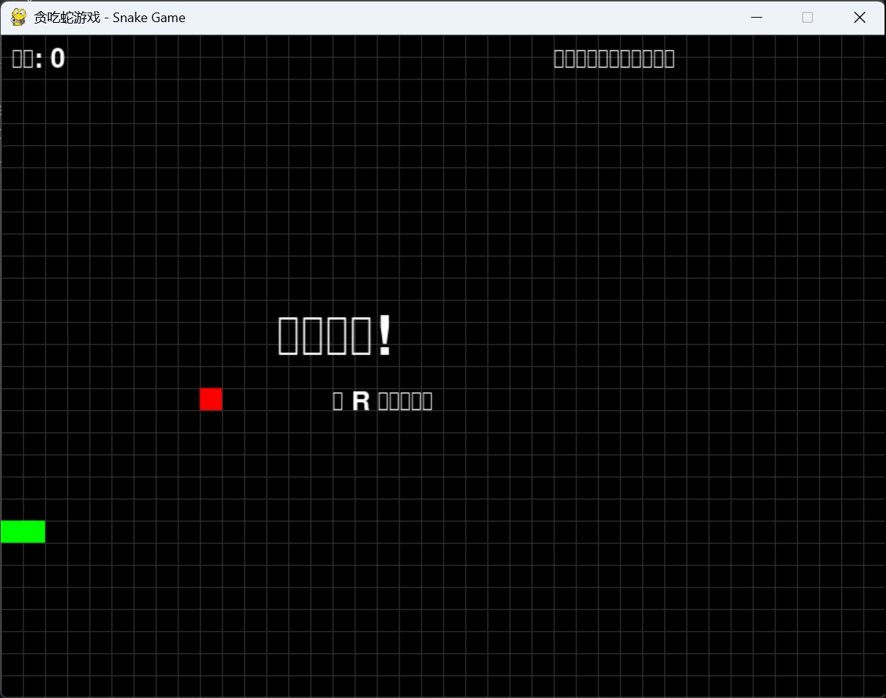

# ChatDev-DeepSeek

## 修改

- `requirements.txt` 中将 `openai` 库版本升级到 `2.7.1`

- 在 `run.py`, `camel/typing.py`, `camel/model_backend.py`, `utils.py` 中曾设 `DeepSeek` 接口

- 修改了 `run.py`, `camel/model_backend.py`, `camel/web_spider.py`, `ecl/embedding.py`, `ecl/utils.py` 中密钥导入顺序，改为局部导入而非全局。

- 修改 `camel/agents/chat_agent.py` 中内部代码不兼容问题

    - 原代码：

        ```python
        output_messages = [
            ChatMessage(role_name=self.role_name, role_type=self.role_type,
                        meta_dict=dict(), **dict(choice.message))
            for choice in response.choices
        ]
        ```

    - 修改后：

        ```python
        output_messages = [
            ChatMessage(
                role_name=self.role_name, 
                role_type=self.role_type,
                meta_dict=choice.message.model_dump(),
                role=choice.message.role,
                content=choice.message.content
            )
            for choice in response.choices
        ]
        ```

- 修改 `chatdev/phase.py` 中编码问题
	- 原代码：
		```python
		code_content = open(os.path.join(chat_env.env_dict['directory'], filename)).read()
		```
	- 修改后：
		```python
		code_content = open(os.path.join(chat_env.env_dict['directory'], filename), encoding='utf-8').read()
		```


## 测试时使用配置

- `CompanyConfig\Default\ChatChainConfig.json`
- `CompanyConfig\Default\PhaseConfig.json`
- `CompanyConfig\Default\RoleConfig.json`

## 使用方法

下载安装虚拟环境、依赖包等操作不再赘述，同原项目完全相同。

1. 配置DeepSeek环境

    ```bash
    $env:DEEPSEEK_API_KEY = "sk-**************************"
    ```

2. 运行命令

    ```bash
    python run.py --task "[Your Description]" --name "[Project Name]" --model DEEPSEEK
    ```


## 结果展示


